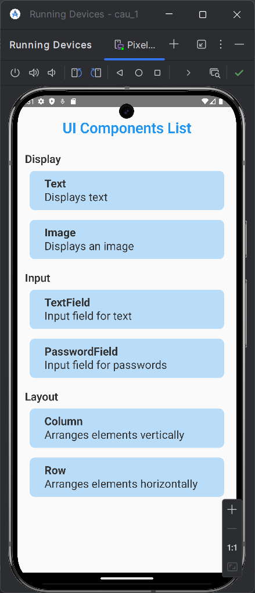
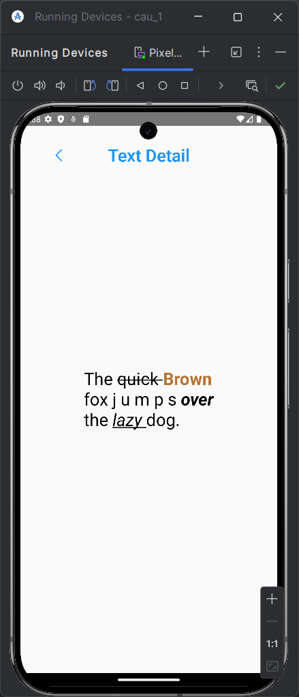
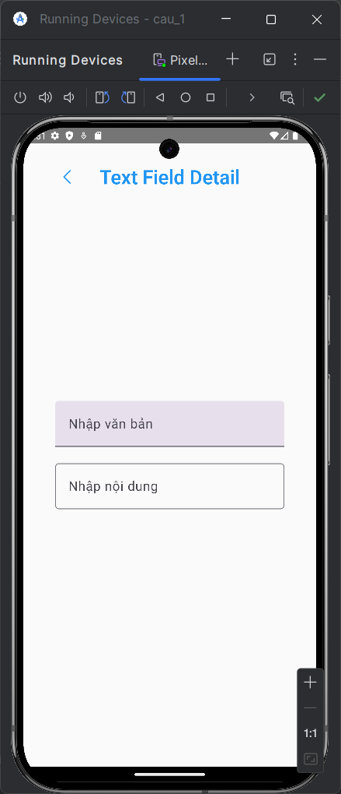
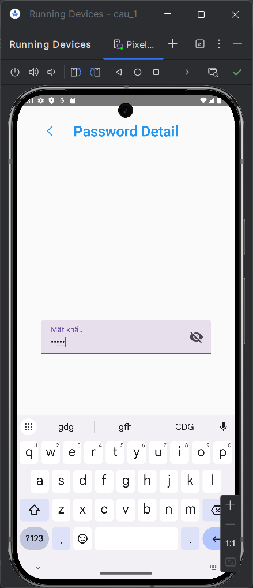
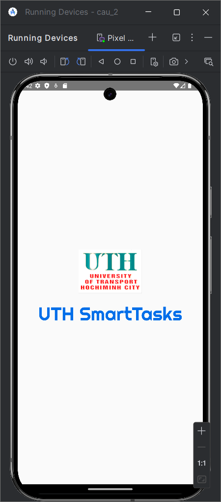
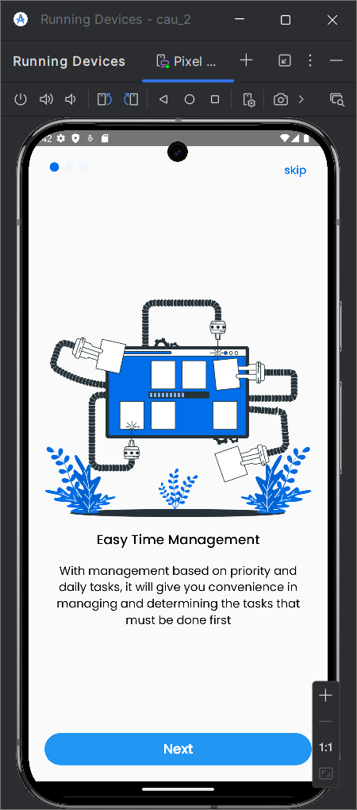
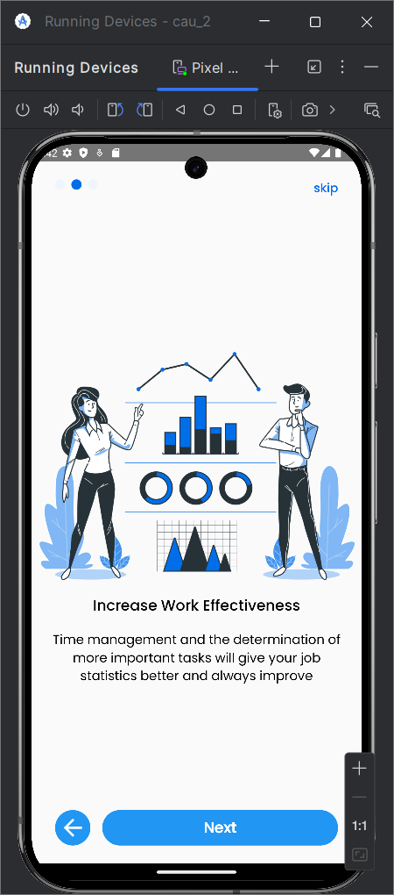
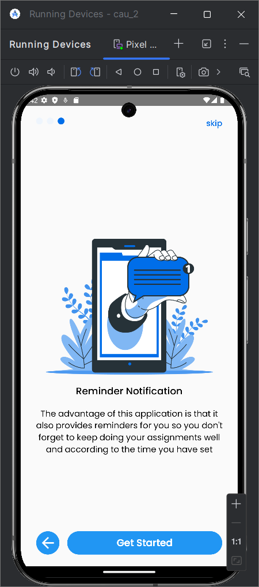

# 083205004013_NguyenHoHoangPhuc_Baitap3
## Câu 1:
- Dùng NavHost để quản lý các screen.
- Tổng có 8 screen, trong đó 6 screen mô tả một số cách thể hiện của:
  - Text.
  - Image.
  - Text field.
  - Passwork.
  - Column.
  - Row.
## Hình ảnh mô tả cho câu 1:
- Giao diện ứng dụng:
- 
- Giao diện Text detail:
-   
- Giao diện Text field detail:
-   
- Giao diện Passwork detail:
-   
  
## Câu 2:
- Dùng NavHost để quản lý các screen.
- Dùng LaunchedEffect để splash screen chỉ xuất hiện trong 2.5 giây sau đó chuyển sang StartedFirst.
- Và popUpTo để xóa screen ra khỏi back stack tránh trường hợp back về được splash screen.
## Hình ảnh mô tả cho câu 2:
- Splash:  
-   
- StartedFirst:  
-   
- StartedSecond:
-   
- StartedThird:
-   
